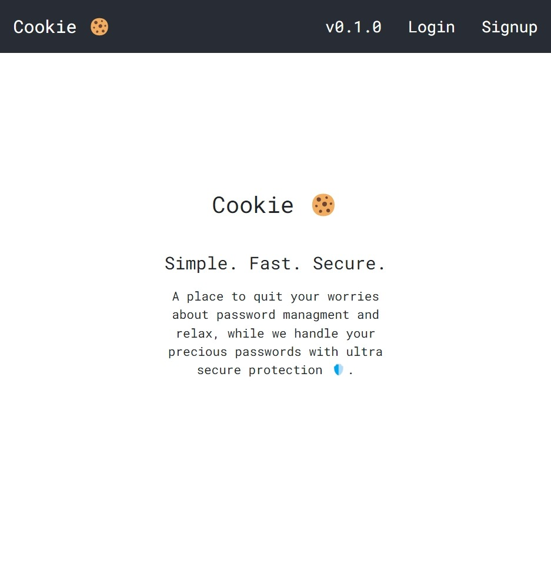
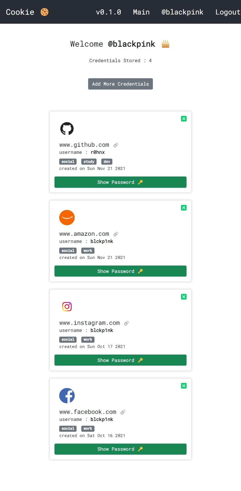
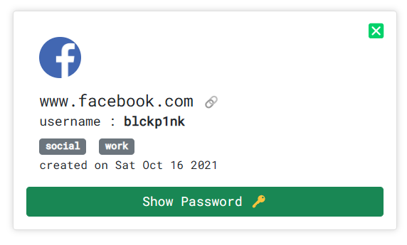
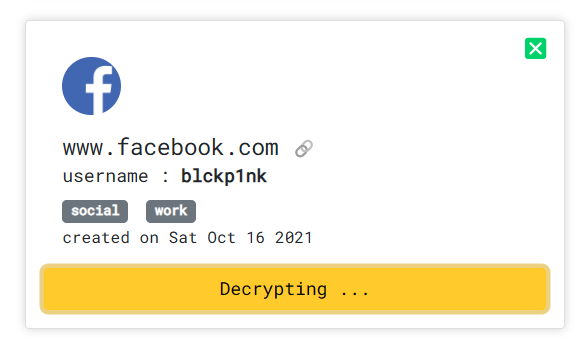
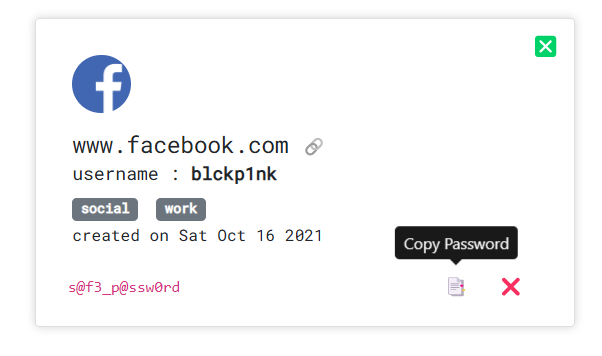
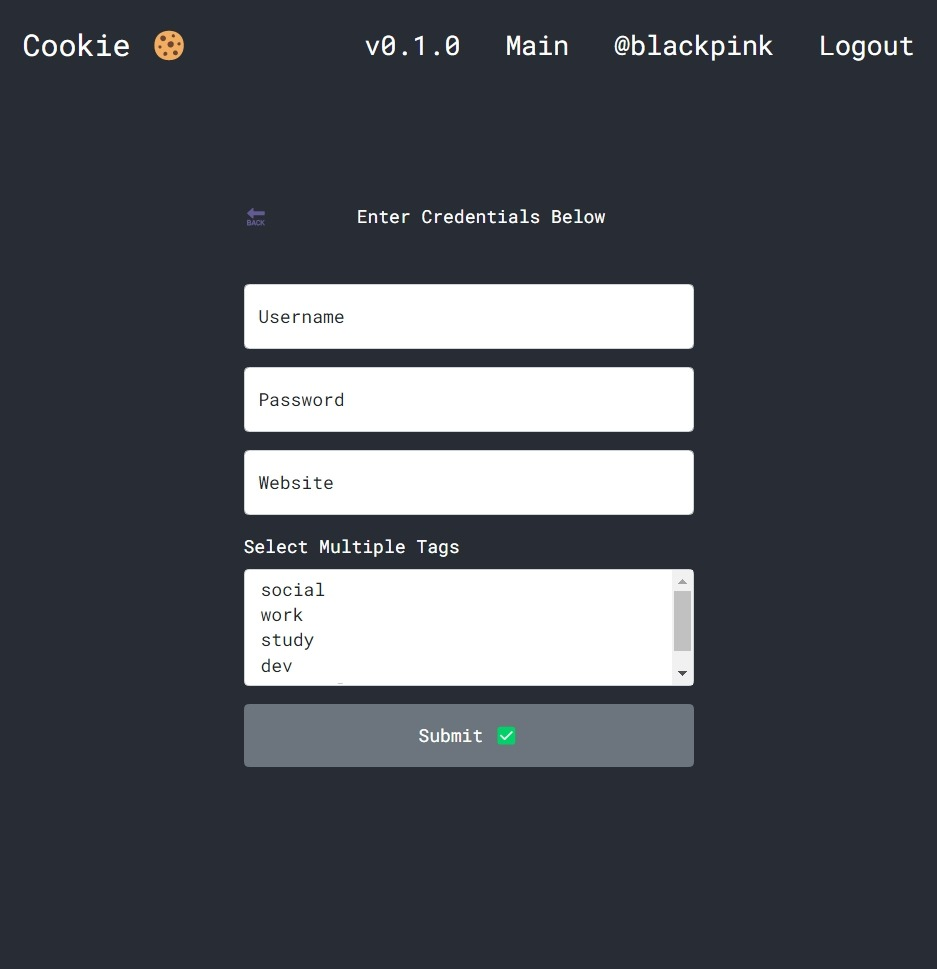

# Table of contents

- [Password Manager](#password-manager)
  - [Why Not To Use Your Browser For Passwords](#why-not-to-use-your-browser-for-passwords)
  - [Core Features](#core-features)
- [Backend](#backend)
  - [package.json](#packagejson)
  - [Encryption](#encryption)
    - [What is IV](#what-is-iv)
    - [What is aes-256-gcm](#what-is-aes-256-gcm)
    - [What is tag](#what-is-tag)
  - [Decryption](#decryption)
  - [Moment of truth](#moment-of-truth)
  - [Why should you use apollo server](#why-should-you-use-apollo-server)
  - [Seting up apollo server](#seting-up-apollo-server)
  - [How it looks in our Database](#how-it-looks-in-our-database)
  - [Authentication](#authentication)
  - [What is JSON Web Token](#what-is-json-web-token)
  - [When should you use JSON Web Tokens](#when-should-you-use-json-web-tokens)
  - [What is the JSON Web Token structure?](#what-is-the-json-web-token-structure)
    - [Header](#header)
    - [Payload](#payload)
    - [Signature](#signature)
  - [Putting all together](#putting-all-together)
  - [How do JSON Web Tokens work](#how-do-json-web-tokens-work)
  - [Why should we use JSON Web Tokens](#why-should-we-use-json-web-tokens)
- [Frontend](#frontend)
  - [dependencies](#dependencies)
  - [React](#react)
    - [Declarative](#declarative)
    - [Component-Based](#component-based)
    - [Learn Once, Write Anywhere](#learn-once-write-anywhere)
    - [A Simple Component](#a-simple-component)
  - [Project Structure](#project-structure)
  - [`index.jsx`](#indexjsx)
  - [`App.jsx`](#appjsx)
  - [`Navbar.jsx`](#navbarjsx)
  - [`Home.jsx`](#homejsx)
  - [`Login.jsx`](#loginjsx)
  - [`Main.jsx`](#mainjsx)
  - [`FetchPassword.jsx`](#fetchpasswordjsx)
  - [`AddCredentials.jsx`](#addcredentialsjsx)
- [Future Improvements](#future-improvements)
- [Conclusion](#conclusion)
  - [Accessible everywhere](#accessible-everywhere)
  - [No downloads or extensions required](#no-downloads-or-extensions-required)

# Password Manager

A password manager is a computer program that allows users to store, generate, and manage their passwords for local applications and online services. A password manager assists in generating and retrieving complex passwords, storing such passwords in an encrypted database, or calculating them on demand. For the past seven years "**123456**" and "**password**" have been the two most commonly used passwords on the web. The problem is, most of us don't know what makes a good password and aren't able to remember hundreds of them anyway.

## Why Not To Use Your Browser For Passwords

Most web browsers offer at least a rudimentary password manager. (This is where your passwords are stored when Google Chrome or Mozilla Firefox ask if you'd like to save a password.) This is better than reusing the same password everywhere, but browser-based password managers are limited. [Read More](https://www.avira.com/en/blog/browser-based-password-managers-vs-dedicated-password-managers)

## Core Features

✅ Open source

✅ Zero-knowledge encryption

✅ Store identities

✅ Unlimited device types

✅ Browser, Mobile, Desktop apps

✅ Unlimited vault items

✅ Basic two-step login

# Backend

## package.json

```json
"dependencies": {
  "apollo-server": "^3.1.2",
  "dotenv": "^10.0.0",
  "graphql": "^15.5.1",
  "mongoose": "^6.0.7"
},
```

`crypto` package is now a built-in Node module.

## Encryption

We are going to use the AES algorithm which is an iterative, symmetric-key block cipher that supports cryptographic keys **(secret keys)** of 128, 192, and 256 bits to encrypt and decrypt data in blocks of 128 bits. The below figure shows the high-level AES algorithm:


**Note** : `ENCRYPT_KEY` must be of 32 bytes

```js
const encrypt = (password) => {
  const iv = Buffer.from(randomBytes(16));
  // iv : initialization vector
  const cipher = createCipheriv(
    "aes-256-gcm",
    Buffer.from(process.env.ENCRYPT_KEY),
    iv
  );
  const encpass = Buffer.concat([cipher.update(password), cipher.final()]);
  return {
    iv: iv.toString("hex"),
    password: encpass.toString("hex"),
    tag: cipher.getAuthTag().toString("hex"),
  };
};
```

> Know more about [createCipheriv](https://nodejs.org/api/crypto.html#crypto_crypto_createcipheriv_algorithm_key_iv_options) function and [Buffer](https://nodejs.org/api/buffer.html#buffer_class_buffer).

### What is IV

In cryptography, an [initialization vector (IV)](https://en.wikipedia.org/wiki/Initialization_vector) or starting variable (SV) is an input to a cryptographic primitive being used to provide the initial state.

### What is aes-256-gcm

In cryptography, [Galois/Counter Mode (GCM)](https://en.wikipedia.org/wiki/Galois/Counter_Mode) is a mode of operation for symmetric-key cryptographic block ciphers which is widely adopted for its performance. GCM throughput rates for state-of-the-art, high-speed communication channels can be achieved with inexpensive hardware resources. The operation is an [authenticated encryption](https://en.wikipedia.org/wiki/Authenticated_encryption) algorithm designed to provide both data authenticity (integrity) and confidentiality. GCM is defined for block ciphers with a block size of 128 bits. Galois Message Authentication Code (GMAC) is an authentication-only variant of the GCM which can form an incremental message authentication code. Both GCM and GMAC can accept initialization vectors of arbitrary length.

### What is tag

The authentication tag is defined as an output parameter in GCM. In all the API's I've encountered it's appended to the ciphertext. Where it is actually placed is up to the protocol designer. The name "tag" of course kind of indicates that it should be tagged to the ciphertext and that may well mean direct concatenation. For the sake of clarity, we have placed it as a separate key.

## Decryption

```js
const decrypt = (encpass) => {
  const decipher = createDecipheriv(
    "aes-256-gcm",
    Buffer.from(process.env.ENCRYPT_KEY),
    Buffer.from(encpass.iv, "hex")
  );
  decipher.setAuthTag(Buffer.from(encpass.tag, "hex"));
  const decpass = Buffer.concat([
    decipher.update(Buffer.from(encpass.password, "hex")),
    decipher.final(),
  ]);
  return decpass.toString();
};
```

> Know more about [createDecipheriv](https://nodejs.org/api/crypto.html#crypto_crypto_createdecipheriv_algorithm_key_iv_options) function

## Moment of truth


> The function is able to retrieve the original plain text password from the encrypted data, that means encryption and decryption are both working properly.

## Why should you use apollo server

Apollo Server is a community-maintained open-source GraphQL server. It works with many Node.js HTTP server frameworks, or can run on its own with a built-in Express server. [Read More](https://www.apollographql.com/docs/apollo-server/)

## Seting up apollo server

```js
const server = new ApolloServer({
  typeDefs,
  resolvers,
  context: ({ req }) => ({ req }),
});

connect(process.env.MONGODB, {
  useNewUrlParser: true,
  useUnifiedTopology: true,
})
  .then(() => {
    console.log(`Database Connected 🔥`);
    return server.listen({ port: process.env.PORT });
  })
  .then(({ url }) => {
    console.log(`${url} : Server Running 🔥`);
  });
```

> Know more about GraphQL [Schemas, TypeDefs & Resolvers](https://www.prisma.io/blog/graphql-server-basics-the-schema-ac5e2950214e)


Now we can use any API client to quickly and easily send GraphQL requests at port `5555`. In the next part, we'll create a front-end for the same with proper user-authentication, login/signup mutations, create/retrive password query and a decent looking UI for the password manager.

<!-- This is all for this article. Hope you found it helpful :)

You can find me on [Twitter](https://twitter.com/r0hnx) where I'm also sharing my journey as a FullStack Developer. -->

## How it looks in our Database

```json
{
  "_id": { "$oid": "6169d83a95a3081d1fdd0c27" },
  "website": "www.facebook.com",
  "password": "ca0c9d488828e4b76f3cc64777",
  "iv": "b4aa00791a76928d5fbfaf87a7048be7",
  "username": "blckp1nk",
  "tags": ["social", "work"],
  "tag": "b6a4938bd32a558bb04310c120fb6494",
  "createdAt": "2021-10-15T19:36:26.410Z",
  "user": { "$oid": "6169d5b0a11c58e30dc293d1" },
  "__v": { "$numberInt": "0" }
}
```

## Authentication

In order to login, a simple request with `username` & `password` is required, which runs a mutation in the background, which then returns a `jwt` token. We'll learn more about what a `jwt` token as we move forward.

```js
mutation {
  login(identifier: "blackpink@gmail.com", password: "Text@12345678") {
    token
  }
}
```

Response:

```json
{
  "data": {
    "login": {
      "token": "eyJhbGciOiJIUzI1NiIsInR5cCI..."
    }
  }
}
```

> Note : This `token` will be used by for authenticating the user for each request made by the user.


## What is JSON Web Token

JSON Web Token (JWT) is an open standard (RFC 7519) that defines a compact and self-contained way for securely transmitting information between parties as a JSON object. This information can be verified and trusted because it is digitally signed. JWTs can be signed using a secret (with the HMAC algorithm) or a public/private key pair using RSA or ECDSA.

Although JWTs can be encrypted to also provide secrecy between parties, we will focus on signed tokens. Signed tokens can verify the integrity of the claims contained within it, while encrypted tokens hide those claims from other parties. When tokens are signed using public/private key pairs, the signature also certifies that only the party holding the private key is the one that signed it.

## When should you use JSON Web Tokens

Here are some scenarios where JSON Web Tokens are useful:

- **Authorization**: This is the most common scenario for using JWT. Once the user is logged in, each subsequent request will include the JWT, allowing the user to access routes, services, and resources that are permitted with that token. Single Sign On is a feature that widely uses JWT nowadays, because of its small overhead and its ability to be easily used across different domains.

- **Information Exchange**: JSON Web Tokens are a good way of securely transmitting information between parties. Because JWTs can be signed—for example, using public/private key pairs—you can be sure the senders are who they say they are. Additionally, as the signature is calculated using the header and the payload, you can also verify that the content hasn't been tampered with.

## What is the JSON Web Token structure?

In its compact form, JSON Web Tokens consist of three parts separated by dots (.), which are:

- Header
- Payload
- Signature

Therefore, a JWT typically looks like the following.

`xxxxx.yyyyy.zzzzz`

Let's break down the different parts.

### Header

The header typically consists of two parts: the type of the token, which is JWT, and the signing algorithm being used, such as HMAC SHA256 or RSA.

For example:

```json
{
  "alg": "HS256",
  "typ": "JWT"
}
```

Then, this JSON is Base64Url encoded to form the first part of the JWT.

### Payload

The second part of the token is the payload, which contains the claims. Claims are statements about an entity (typically, the user) and additional data. There are three types of claims: registered, public, and private claims.

Registered claims: These are a set of predefined claims which are not mandatory but recommended, to provide a set of useful, interoperable claims. Some of them are: iss (issuer), **exp** (expiration time), **sub** (subject), **aud** (audience), and others.

> Notice that the claim names are only three characters long as JWT is meant to be compact.

Public claims: These can be defined at will by those using JWTs. But to avoid collisions they should be defined in the IANA JSON Web Token Registry or be defined as a URI that contains a collision resistant namespace.

Private claims: These are the custom claims created to share information between parties that agree on using them and are neither registered or public claims.

An example payload could be:

```json
{
  "sub": "1234567890",
  "name": "John Doe",
  "admin": true
}
```

The payload is then Base64Url encoded to form the second part of the JSON Web Token.

> Do note that for signed tokens this information, though protected against tampering, is readable by anyone. Do not put secret information in the payload or header elements of a JWT unless it is encrypted.

### Signature

To create the signature part you have to take the encoded header, the encoded payload, a secret, the algorithm specified in the header, and sign that.

For example if you want to use the HMAC SHA256 algorithm, the signature will be created in the following way:

```json
HMACSHA256(
  base64UrlEncode(header) + "." +
  base64UrlEncode(payload),
  secret)
```

The signature is used to verify the message wasn't changed along the way, and, in the case of tokens signed with a private key, it can also verify that the sender of the JWT is who it says it is.

## Putting all together

The output is three Base64-URL strings separated by dots that can be easily passed in HTML and HTTP environments, while being more compact when compared to XML-based standards such as SAML.

The following shows a JWT that has the previous header and payload encoded, and it is signed with a secret.


## How do JSON Web Tokens work

In authentication, when the user successfully logs in using their credentials, a JSON Web Token will be returned. Since tokens are credentials, great care must be taken to prevent security issues. In general, you should not keep tokens longer than required.

You also should not store sensitive session data in browser storage due to lack of security.

Whenever the user wants to access a protected route or resource, the user agent should send the JWT, typically in the **Authorization** header using the **Bearer** schema. The content of the header should look like the following:

```json
Authorization: Bearer <token>
```

This can be, in certain cases, a stateless authorization mechanism. The server's protected routes will check for a valid JWT in the `Authorization` header, and if it's present, the user will be allowed to access protected resources. If the JWT contains the necessary data, the need to query the database for certain operations may be reduced, though this may not always be the case.

If the token is sent in the `Authorization` header, Cross-Origin Resource Sharing (CORS) won't be an issue as it doesn't use cookies.

The following diagram shows how a JWT is obtained and used to access APIs or resources:


1. The application or client requests authorization to the authorization server. This is performed through one of the different authorization flows. For example, a typical OpenID Connect compliant web application will go through the /oauth/authorize endpoint using the authorization code flow.
2. When the authorization is granted, the authorization server returns an access token to the application.
3. The application uses the access token to access a protected resource (like an API).

Do note that with signed tokens, all the information contained within the token is exposed to users or other parties, even though they are unable to change it. This means you should not put secret information within the token.

## Why should we use JSON Web Tokens

Let's talk about the benefits of **JSON Web Tokens (JWT)** when compared to **Simple Web Tokens (SWT)** and **Security Assertion Markup Language Tokens (SAML)**.

As JSON is less verbose than XML, when it is encoded its size is also smaller, making JWT more compact than SAML. This makes JWT a good choice to be passed in HTML and HTTP environments.

Security-wise, SWT can only be symmetrically signed by a shared secret using the HMAC algorithm. However, JWT and SAML tokens can use a public/private key pair in the form of a X.509 certificate for signing. Signing XML with XML Digital Signature without introducing obscure security holes is very difficult when compared to the simplicity of signing JSON.

JSON parsers are common in most programming languages because they map directly to objects. Conversely, XML doesn't have a natural document-to-object mapping. This makes it easier to work with JWT than SAML assertions.

Regarding usage, JWT is used at Internet scale. This highlights the ease of client-side processing of the JSON Web token on multiple platforms, especially mobile.


Comparison of the length of an encoded JWT and an encoded SAML

# Frontend

## dependencies

```json
"dependencies": {
    "@apollo/client": "^3.4.17",
    "@testing-library/jest-dom": "^5.11.4",
    "@testing-library/react": "^11.1.0",
    "@testing-library/user-event": "^12.1.10",
    "graphql": "^16.0.1",
    "react": "^17.0.2",
    "react-dom": "^17.0.2",
    "react-router-dom": "^6.0.2",
    "react-scripts": "4.0.3",
    "reactstrap": "^9.0.1",
    "web-vitals": "^1.0.1"
  },
```

## React

A JavaScript library for building user interfaces

### Declarative

React makes it painless to create interactive UIs. Design simple views for each state in your application, and React will efficiently update and render just the right components when your data changes.

Declarative views make your code more predictable and easier to debug.

### Component-Based

Build encapsulated components that manage their own state, then compose them to make complex UIs.

Since component logic is written in JavaScript instead of templates, you can easily pass rich data through your app and keep state out of the DOM.

### Learn Once, Write Anywhere

We don’t make assumptions about the rest of your technology stack, so you can develop new features in React without rewriting existing code.

React can also render on the server using Node and power mobile apps using React Native.

### A Simple Component

React components implement a render() method that takes input data and returns what to display. This example uses an XML-like syntax called JSX. Input data that is passed into the component can be accessed by render() via this.props.

JSX is optional and not required to use React. Try the Babel REPL to see the raw JavaScript code produced by the JSX compilation step.

```jsx
class HelloMessage extends React.Component {
  render() {
    return <div>Hello {this.props.name}</div>;
  }
}

ReactDOM.render(
  <HelloMessage name="Rohan" />,
  document.getElementById("hello-example")
);
```

## Project Structure

```json
src
├── components
│   ├── AddCredentials.jsx
│   ├── App.jsx
│   ├── FetchPassword.jsx
│   ├── Home.jsx
│   ├── Login.jsx
│   ├── Main.jsx
│   ├── NavBar.jsx
│   ├── NotFound.jsx
│   ├── Profile.jsx
│   └── Signup.jsx
├── graphql
│   ├── mutations.jsx
│   └── query.jsx
├── styles
│   ├── AddCredentials.css
│   ├── App.css
│   ├── Home.css
│   ├── Login.css
│   ├── Main.css
│   ├── NavBar.css
│   ├── Profile.css
│   └── Signup.css
├── index.css
├── index.jsx
└── logo.svg
```

We'll move in a top-down approach and see most of the major compoents.

## `index.jsx`

```jsx
render(
  <React.StrictMode>
    <ApolloProvider client={client}>
      <BrowserRouter>
        <Routes>
          <Route path="/" element={<App />} />
          <Route path="/login" element={<Login />} />
          <Route path="/register" element={<Signup />} />
          <Route path="/main" element={<Main />} />
          <Route path="/add" element={<AddCredentials />} />
          <Route path="/u/:username" element={<Profile />} />
          <Route path="*" element={<NotFound />} />
        </Routes>
      </BrowserRouter>
    </ApolloProvider>
  </React.StrictMode>,
  document.getElementById("root")
);
```

## `App.jsx`

```jsx
function App() {
  return (
    <div className="App">
      <NavBar />
      <Home />
    </div>
  );
}
```

## `Navbar.jsx`

```jsx
export default function NavBar() {
  const [data, setData] = useState(JSON.parse(localStorage.getItem("data")));
  const { username, token } = data ? data : {};
  return (
    <div>
      <nav>
        <div className="banner">
          <Link to="/">Cookie 🍪</Link>
        </div>
        <div className="events">
          <div className="version">v{version}</div>
          {data && token && (
            <>
              <Link to={"/main"}>Main</Link>
              <Link to={"/u/" + username}>@{username}</Link>
              <Link to="/">Logout</Link>
            </>
          )}
          {!data && (
            <>
              <Link to="/login">Login</Link>
              <Link to="/register">Signup</Link>
            </>
          )}
        </div>
      </nav>
    </div>
  );
}
```

## `Home.jsx`

```jsx
export const Home = () => {
  return (
    <div className="content">
      <h1 className="mb-5 banner">Cookie 🍪</h1>
      <p>Simple. Fast. Secure.</p>
      <small>
        A place to quit your worries about password managment and relax, while
        we handle your precious passwords with ultra secure protection 🛡️.
      </small>
    </div>
  );
};
```


<center>Homepage = Navbar + Home</center>

## `Login.jsx`

```jsx
export const Login = () => {
  const [identifier, setEmail] = useState("");
  const [password, setPassword] = useState("");
  const [login, { data }] = useMutation(LOGIN);
  const submitHandler = (event) => {
    event.preventDefault();
    try {
      login({ variables: { identifier, password } });
      setEmail("");
      setPassword("");
    } catch (err) {
      throw err.message;
    }
  };
  return (
    <div className="login">
      <div className="navigation">
        <span onClick={() => navigate("/")}>🔙</span>
        <h2 className="mb-5 banner">Cookie 🍪</h2>
        <span></span>
      </div>
      <Row form className="login_row">
        <Form inline action="/" onSubmit={submitHandler}>
          <FormGroup floating>
            <Input
              id="exampleEmail"
              name="identifier"
              placeholder="Email"
              type="identifier"
              onChange={onEmailChange}
            />
            <Label for="exampleEmail">Email</Label>
          </FormGroup>{" "}
          <FormGroup floating>
            <Input
              id="examplePassword"
              name="password"
              placeholder="Password"
              type="password"
              onChange={onPasswordChange}
            />
            <Label for="examplePassword">Password</Label>
          </FormGroup>{" "}
          <Button block style={{ padding: "15px" }} type="submit">
            Login
          </Button>
        </Form>
      </Row>
    </div>
  );
};
```


<center>Login</center>

## `Main.jsx`

```jsx
return (
    {data && (
      <>
        <NavBar />
        <div className="main">
          <div className="welcome">
            <Link to="/add">
              <Button className="my-5">Add More Credentials</Button>
            </Link>
          </div>
          {data.getWebsites.map((website) => (
            <div className="website">
              <Card body key={website.id}>
                <CardBody>...</CardBody>
                <FetchPassword
                  id={website.id}
                  password={website.password}
                  tag={website.tag}
                  key={`f${website.id}`}
                />
              </Card>
            </div>
          ))}
        </div>
      </>
    )}
);
```


<center>Main</center>

## `FetchPassword.jsx`

```jsx
const FetchPassword = ({ id, password, tag }) => {
  const [getPassword, { loading, error, data }] = useLazyQuery(GET_PASSWORD, {
    variables: { id, password, tag },
  });
  if (error) {
    console.log(error);
    return <Button color="danger">⛔</Button>;
  }
  if (loading) return <Button color="warning">Decrypting ...</Button>;
  if (data && show)
    return (
      <Container>
        <code>{data?.getPassword}</code>
        <div className="options">
          <Button color="white" id="Password">
            📑
          </Button>
          <Button color="white" id="Hide">
            ❌
          </Button>
        </div>
      </Container>
    );
  return <Button>Show Password 🔑</Button>;
};
```

There are 3 states for FetchPassword Component:

1. Inactive
2. Lading
3. Active

<div style="display: flex; justify-content: center;">

</div>
<center>Show Password (inactive)</center>

<div style="display: flex; justify-content: center;">

</div>
<center>Show Password (loading)</center>

<div style="display: flex; justify-content: center;">

</div>
<center>Show Password (active)</center>

## `AddCredentials.jsx`

```jsx
export const AddCredentials = () => {
  const [username, setEmail] = useState("");
  const [website, setWebsite] = useState("");
  const [password, setPassword] = useState("");
  const [create, { data }] = useMutation(CREATE);
  const navigate = useNavigate();

  const onEmailChange = (event) => {
    setEmail(event.target.value);
  };
  const onPasswordChange = (event) => {
    setPassword(event.target.value);
  };
  const onWebsiteChange = (event) => {
    setWebsite(event.target.value);
  };

  const submitHandler = (event) => {
    event.preventDefault();
    try {
      const formData = {
        username,
        password,
        website,
        tags: [
          ...document.querySelector("#exampleSelectMulti").selectedOptions,
        ].map((e) => e.value),
      };
      create({ variables: formData });
      setEmail("");
      setPassword("");
      setWebsite("");
    } catch (err) {
      console.log(err.message);
      navigate("/add");
    }
  };

  return (
    <>
      <NavBar />
      <div className="login">
        <div className="navigation">
          <span onClick={() => navigate("/main")}>🔙</span>
          <p className="mb-5 banner">Enter Credentials Below</p>
          <span></span>
        </div>
        <Row form className="login_row">
          <Form inline action="/" onSubmit={submitHandler}>
            <FormGroup floating>
              <Input
                id="exampleUsername"
                name="username"
                placeholder="Username"
                type="username"
                onChange={onEmailChange}
              />
              <Label for="exampleUsername">Username</Label>
            </FormGroup>{" "}
            <FormGroup floating>
              <Input
                id="examplePassword"
                name="password"
                placeholder="Password"
                type="password"
                onChange={onPasswordChange}
              />
              <Label for="examplePassword">Password</Label>
            </FormGroup>{" "}
            <FormGroup floating>
              <Input
                id="exampleWebsite"
                name="website"
                placeholder="www.example.com"
                type="text"
                onChange={onWebsiteChange}
              />
              <Label for="exampleWebsite">Website</Label>
            </FormGroup>{" "}
            <FormGroup>
              <Label for="exampleSelectMulti" className="white">
                Select Multiple Tags
              </Label>
              <Input id="exampleSelectMulti" multiple name="tags" type="select">
                <option>social</option>
                <option>work</option>
                <option>study</option>
                <option>dev</option>
                <option>personal</option>
              </Input>
            </FormGroup>{" "}
            <Button block style={{ padding: "15px" }} type="submit">
              Submit ✅
            </Button>
          </Form>
        </Row>
      </div>
    </>
  );
};
```


<center>Add Credentials</center>

## Future Improvements

✅ Free cloud hosting

✅ Secure password generator

✅ Encrypted export

✅ Unlimited devices + syncing

✅ Store notes, credit cards, identities

# Conclusion

This client applications can run on all devices and platforms with a desktop app, browser extensions, a command line interface, and mobile apps. All of these clients are complementary to the ubiquitous web vault that brings the best of this application to users at home, at work, or on the go. Here are a few reasons behind its universal appeal.

## Accessible everywhere

You can access the web vault from anywhere with any device. To get started, just point a modern internet browser to the link and enter your username and main password. Only an internet connection is required.

The web vault is not a typical web page, but rather a true client application that maintains end-to-end, zero-knowledge encryption. It runs locally on your device in JavaScript, and all data sent to and from it remains encrypted, so only you can access the secure data in your vault with the key generated by your master password.

## No downloads or extensions required

Experience the power of the web vault and the security of its end-to-end zero knowledge encryption without having to download or install extensions. Since it’s web based, all that’s needed is any modern browser (eg. Google Chrome, Microsoft Edge) that’s already installed on most devices. It’s the perfect solution for when using a friend’s laptop or a work laptop without install permissions.
